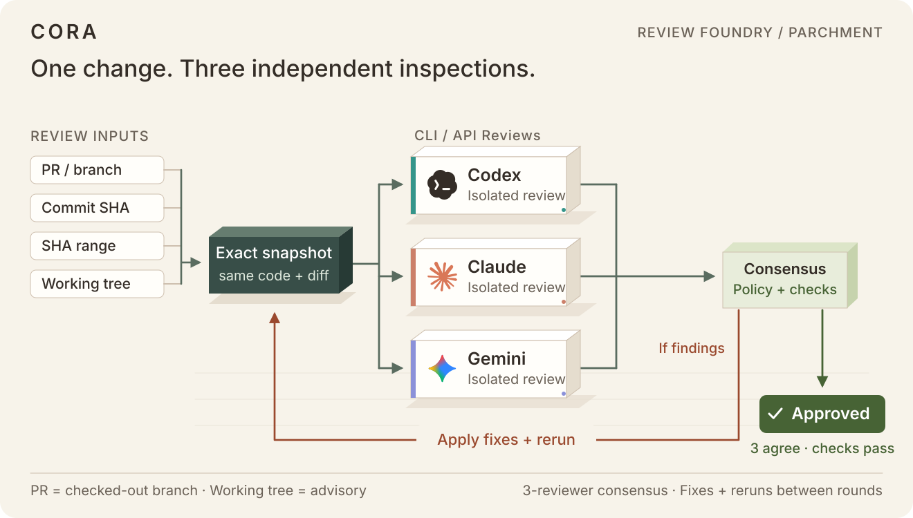

# CORA

**Independent code reviews. One approval decision.**

CORA (Consensus-Oriented Review and Approval) runs Codex, Claude, and optional
Gemini reviews against the same Git change. It combines their findings, applies
your approval policy, and saves the results locally so you can fix, review, and
repeat before opening a pull request.

<picture>
  <source media="(max-width: 600px)" srcset="docs/assets/review-flow-mobile.svg">
  
</picture>

The diagram shows all three reviewers enabled. Codex and Claude are the default
pair; Gemini is opt-in. CLI/API reviews currently run through the installed
provider CLIs, using existing logins or explicitly authorized API billing.

**Alpha:** this README describes the current source. Review records are local
and unsigned; CORA does not publish reviews, push changes, or merge PRs.

## Get started

### 1. Install CORA

You need Git, Go 1.27 or later, and `make`. Install
[Codex CLI](https://developers.openai.com/codex/cli/) and
[Claude Code](https://code.claude.com/docs/en/quickstart), then sign in with
ChatGPT and a Claude.ai subscription, respectively.

```bash
git clone https://github.com/herikwebb/cora.git
cd cora
make install
export PATH="$HOME/.local/bin:$PATH"
cora --version
```

Add the `export` line to your shell configuration if `~/.local/bin` is not
already on `PATH`. To choose another install directory, use
`make install INSTALL_DIR=/path/already/on/PATH`.

### 2. Review your branch

In the repository you want to review, check out your feature branch and commit
your changes. Branch reviews require a clean working tree by default.
Replace `origin/main` below with your base branch, such as `main` or
`upstream/main`.

```bash
cd /path/to/your-project
cora plan --base origin/main
cora review --base origin/main
cora show latest
```

`plan` previews the target, reviewers, policy, and checks without starting a
review or using model quota. Resolve any blocking issues it reports before
running `review`.

### 3. Fix, repeat, and verify

If CORA requests changes, address the findings, commit your fixes, and run
`cora review --base origin/main` again. After approval, confirm that it still
matches the commit you intend to submit:

```bash
cora verify --head HEAD
```

A review exits with `0` for approval, `2` for changes requested, `3` when a human
decision is needed, or `4` when incomplete. See [all exit codes](#exit-codes).

## Choose what to review

| Target | Command |
| --- | --- |
| Current branch or checked-out PR branch | `cora review --base origin/main` |
| One commit | `cora review --commit abc123` |
| Commit range | `cora review --range abc123..def456` |
| Staged, unstaged, and untracked changes | `cora review --uncommitted` |

Working-tree reviews are advisory and cannot create a final approval. To review
a PR, check out its branch first; CORA does not accept PR URLs or numbers.
For a merge commit, select a parent with `--parent 1` or `--parent 2`.

## Add Gemini

Install [Gemini CLI](https://geminicli.com/docs/get-started/installation/)
0.46.0 or later and run `gemini` once to sign in with Google. Find your personal
configuration file:

```bash
cora config path
```

Create the file and its parent directory if needed, then add or update these
settings. Keep `minimum_approvals` at the top level, before any TOML section:

```toml
minimum_approvals = 3

[reviewers.gemini]
enabled = true
```

This enables Gemini and raises the approval threshold to three. Enabling it
alone leaves the threshold at two; every enabled reviewer must still complete.
Run `cora plan --base origin/main` to check the effective settings.

## Approval and validation

Each reviewer inspects an independent snapshot of the same change. Approval
requires the configured number of approvals, no unresolved blocking findings,
and passing required checks. Incomplete reviews cannot approve. By default,
`blocker` and `major` findings block approval; `minor` and `note` findings do not.

Tests are separate from model reviews. Without configured checks or imported
test evidence, CORA records validation as `not_run`. For code you trust, run
detected checks and require validation with:

```bash
cora review --base origin/main --strict --profile auto --allow-unsafe-checks
```

`--strict` also makes minor findings blocking. `--profile auto` detects Go,
Node, and Python projects. `--allow-unsafe-checks` authorizes execution of
reviewed code on your host in a disposable clone; these checks are not sandboxed.
Configured checks also require this authorization. You can instead
[import passing CI evidence](docs/reference.md#external-validation-evidence).

## Configuration

Defaults work without a configuration file. Use `cora config path` to find
your personal settings. Repository settings in `.cora/config.toml` override
personal settings and are read from the trusted base revision, so changes on
the branch under review cannot change their own approval rules.

See the [example configuration](examples/config.toml) for model names, limits,
reviewers, and checks. API-key authentication is off by default; enable it for
a run with `--allow-api-billing` when separately billed usage is intended.

## Useful commands

```bash
cora status --active                  # Running and queued reviews
cora list                            # Saved runs
cora show latest --verbose           # Findings and original reviewer reports
cora show latest --json              # Machine-readable results
cora retry latest --reviewer claude   # Retry Claude, keeping completed results
cora review --help                   # All review options
```

Use `--reviewer codex` or `--reviewer gemini` to retry another provider. Run
records live under `.git/cora/` (the shared Git directory for worktrees).

For an opt-in coding-agent loop, see the [auto-fix guide](docs/auto-fix.md).
It leaves edits for you to inspect and commit. Gemini-enabled auto-fix loops
currently stop incomplete because Gemini does not report the turn and cost
metrics needed to enforce the loop's limits.

## Exit codes

| Code | Meaning |
| ---: | --- |
| 0 | Approved or command succeeded |
| 2 | Changes requested |
| 3 | Human decision required |
| 4 | Review incomplete |
| 5 | Approval is stale |
| 6 | Auto-fix paused until a provider quota reset |
| 10 | Configuration, Git, or tool failure |
| 130 | Canceled by an interrupt or termination signal |

## More details

- [Review workflows](docs/workflows.md): planning, security passes, retries,
  web evidence, and preparing a PR.
- [Reference](docs/reference.md): configuration, approval policy, validation,
  provider isolation, and saved records.
- [Auto-fix](docs/auto-fix.md): limits, approval rules, and resuming a paused loop.
- [Review writing rules](prompts/review-writing.md) and
  [diagram credits](docs/assets/NOTICE.md).

For local development, `make build` creates `bin/cora`; `make test` runs the
Go tests with race detection and `go vet`.
